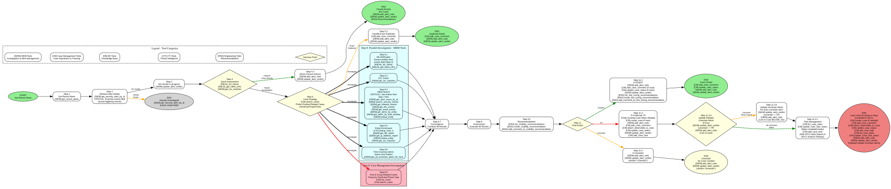
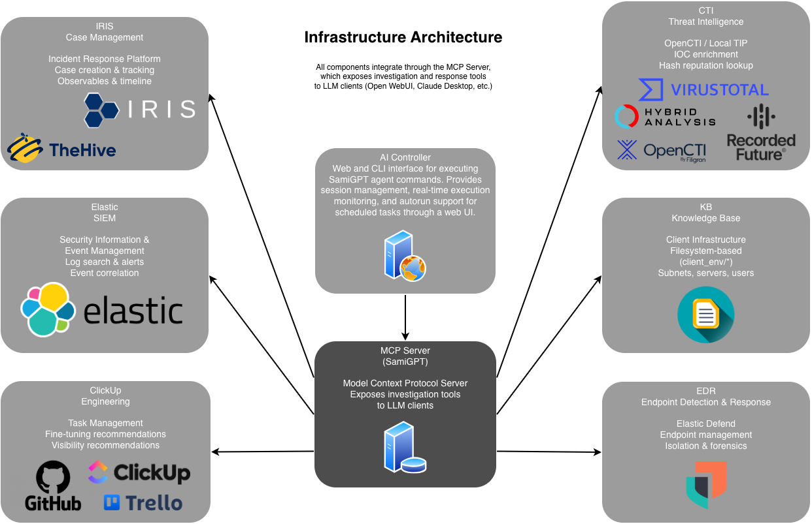

# SamiGPT

**SamiGPT** is an AI-powered security investigation and incident response platform that provides security operations teams with intelligent automation for case management, SIEM analysis, and CTI enrichment through the Model Context Protocol (MCP).

> **Note:** This project is currently under active development. Features, APIs, and documentation may change as development progresses.

## Demo

Watch the demo video to see SamiGPT in action:

[Demo Video](https://youtu.be/usd8ed-7AQg)

For detailed documentation and presentation materials:

[AI Agents Presentation PDF](demo/BHMEA25_AI_Agents.pdf)

### Quick Start

SamiGPT is started from a single entry point. That process serves the web UI
and, by default, also starts the MCP server as a **separate HTTPS listener**
with its own settings and health check.

**Steps:**

1. **Activate virtual environment:**
   ```bash
   source venv/bin/activate  # On Windows: venv\Scripts\activate
   ```

2. **Set the UI password** in `config.json` (copied from `config.json.example` on first run):
   ```json
   "web": {
     "username": "admin",
     "password": "choose-a-strong-password",
     "session_secret": ""
   }
   ```
   `session_secret` is generated automatically if left empty.

3. **Start the application:**
   ```bash
   python app.py
   ```
   The UI binds **HTTPS on `0.0.0.0:8081`**. The first start writes a self-signed certificate to `certs/`. Your browser will warn until you trust that cert or replace it with a real one.

   Optional flags:
   ```bash
   python app.py --port 8081
   python app.py --no-mcp    # web UI only; start MCP later from the UI
   python app.py --debug     # auto-reload when files under src/ change
   ```

4. **Open your browser:**
   Navigate to `https://<host>:8081` and sign in. Nothing in the UI, APIs, or static files is reachable without a valid session.

5. **Choose an LLM provider:**
   Open **Settings** and select Cursor Agent, OpenAI, OpenRouter, Open WebUI,
   or any OpenAI-compatible endpoint. Save, then use **Test provider**.

6. **Check the MCP server:**
   Use the **MCP** button in the header. It shows health, bound host/port,
   registered tools, and start/stop/restart controls. MCP HTTPS routes require
   `Authorization: Bearer <mcp.api_token>` from `config.json`.

#### MCP Server (stdio, for Cursor / Claude Desktop)

The HTTP MCP listener started by `app.py` is what the web UI health-checks.
Cursor IDE and Claude Desktop still connect over stdio if you prefer:

```bash
python -m src.mcp.mcp_server
```

See "Connect MCP Server to AI Tools" below.

**Note:** Cursor Agent is one optional LLM backend. OpenAI, OpenRouter, Open WebUI,
and custom OpenAI-compatible APIs work without the Cursor IDE `cursor-agent` binary.
Those providers call SamiGPT tools through the MCP server when it is running.

#### Install as a systemd service (`servee`)

To run SamiGPT as a boot-persistent service, use the installer under `servee/`.
It copies the app to `/opt/servee`, creates a Python 3.10+ venv, installs
dependencies, and enables + starts the `servee` unit (`Restart=always`).
Re-running the script reinstalls cleanly and preserves `config.json`, `certs/`,
`data/`, and `logs/`.

```bash
# Install or reinstall (requires root; stop any manual `python app.py` first)
sudo ./servee/install.sh

# Service control
sudo systemctl status servee
sudo systemctl restart servee
sudo systemctl stop servee
sudo systemctl start servee

# Follow logs
journalctl -u servee -f
```

Optional: point the installer at a specific Python 3.10+ binary:

```bash
sudo PYTHON_BIN=/path/to/python3.11 ./servee/install.sh
```

After install, the UI is at `https://<host>:8081` and MCP at `:8082`, with
runtime files under `/opt/servee`.

## Overview

SamiGPT acts as an MCP server that exposes security investigation and response capabilities as tools that can be used by AI agents, LLM tools, and automated workflows. It provides a unified, vendor-neutral API layer that connects to:

- **Case Management Systems** (TheHive, IRIS)
- **SIEM Platforms** (Elastic)
- **EDR Solutions** (Elastic Defend)
- **Threat Intelligence** (OpenCTI, Local TIP)

The platform enables automated triage, investigation, correlation, and response workflows through intelligent agent profiles organized by SOC tier (SOC1, SOC2).

## Features

### Core Capabilities

- **Automated Alert Triage**: Intelligent initial assessment and classification of security alerts
- **Case Management**: Create, update, and manage security cases with observables, comments, and timeline tracking
- **SIEM Integration**: Search security events, pivot on indicators, and correlate activities across environments
- **EDR Response**: Endpoint isolation, process termination, and forensic artifact collection
- **Threat Intelligence**: IOC enrichment and reputation analysis
- **Multi-Tier SOC Workflows**: Structured workflows for SOC1 (triage) and SOC2 (investigation)

### Agent Profiles & Runbooks

SamiGPT includes pre-configured agent profiles with specialized runbooks:

- **SOC1 Agents**: Initial alert triage, enrichment, and false positive identification
- **SOC2 Agents**: Deep investigation, correlation, and case analysis

## Workflows

SamiGPT uses structured workflows organized by SOC tier. The following diagrams illustrate the execution flow:

### Agent Profiles Flow

This diagram shows how agent profiles are organized and how routing rules direct cases to the appropriate SOC tier agents.


### Initial Alert Triage (SOC1)

The initial alert triage workflow handles new security alerts, performs quick assessment, enrichment, and determines whether to create a case or close as false positive.



### Case Analysis (SOC2)

The SOC2 case analysis workflow performs deep investigation, SIEM analysis, CTI enrichment, correlation, and prepares cases for SOC3 escalation.


## Installation

### Prerequisites

- Python 3.9 or higher
- pip package manager

### Setup

1. **Clone the repository**:
   ```bash
   git clone <repository-url>
   cd SamiGPT
   ```

2. **Create and activate virtual environment**:
   ```bash
   python3 -m venv venv
   source venv/bin/activate  # On Windows: venv\Scripts\activate
   ```

3. **Install dependencies**:
   ```bash
   pip install --upgrade pip
   pip install -r requirements.txt
   ```

4. **Configure integrations** (see Configuration section below)

### Connect MCP Server to AI Tools

If you're using **Method 2: MCP Server** (see Quick Start above), configure your AI tool to connect to the MCP server:

#### Cursor Integration

1. Open Cursor Settings → Features → Model Context Protocol
2. Add SamiGPT server configuration:
   ```json
   {
     "mcpServers": {
       "sami-gpt": {
         "command": "python",
         "args": ["-m", "src.mcp.mcp_server"],
         "cwd": "/absolute/path/to/SamiGPT"
       }
     }
   }
   ```
3. Restart Cursor and start using SamiGPT tools in chat

#### Claude Desktop Integration

Edit `~/Library/Application Support/Claude/claude_desktop_config.json` (macOS) or `%APPDATA%\Claude\claude_desktop_config.json` (Windows):

```json
{
  "mcpServers": {
    "sami-gpt": {
      "command": "python",
      "args": ["-m", "src.mcp.mcp_server"],
      "cwd": "/absolute/path/to/SamiGPT"
    }
  }
}
```

#### Other MCP-Compatible Tools

The MCP server can also be connected to:
- **Open WebUI** via the HTTPS listener (`https://127.0.0.1:8082/rpc`) or stdio
- **Other LLM tools** that support the Model Context Protocol

HTTPS endpoints when `app.py` is running (defaults). Send `Authorization: Bearer <mcp.api_token>`:

- Health: `https://127.0.0.1:8082/health`
- Tools: `https://127.0.0.1:8082/tools`
- JSON-RPC: `POST https://127.0.0.1:8082/rpc`

## Architecture

### Infrastructure Overview



### Directory Structure

```
SamiGPT/
├── src/
│   ├── api/              # Generic interfaces (CaseManagementClient, SIEMClient, EDRClient)
│   ├── core/             # Configuration, logging, errors, DTOs
│   ├── integrations/     # Vendor-specific implementations
│   │   ├── case_management/  # TheHive, IRIS integrations
│   │   ├── siem/             # Elastic integration
│   │   ├── edr/              # EDR platform integrations
│   │   ├── cti/              # Threat intelligence integrations
│   │   └── eng/              # Engineering board integrations
│   ├── llm/              # Pluggable LLM providers (Cursor, OpenAI, OpenRouter, Open WebUI, custom)
│   ├── mcp/              # MCP server, HTTP transport, supervisor, runbooks
│   ├── orchestrator/     # Workflow orchestration
│   └── web/              # Legacy integration config UI
├── app.py                # Single entry point for the web interface
├── run_books/            # SOC tier runbooks and workflows
├── config/               # Agent profiles and configuration
└── client_env/           # Client-specific infrastructure data (gitignored except templates)
```

### Design Principles

- **Vendor-Neutral APIs**: All integrations implement generic interfaces, allowing easy swapping of security tools
- **Separation of Concerns**: AI/orchestrator layer only interacts with generic APIs, never vendor-specific code
- **Modular Integration**: Each vendor integration is self-contained with HTTP client, models, mappers, and client implementation

## Configuration

Configuration is managed through `config.json` and can be edited via the web interface or directly.


### Configuration File Structure

See `config.json.example` for the complete configuration schema. Key sections:

- `iris` / `thehive`: Case management configuration
- `elastic`: SIEM configuration
- `edr`: EDR platform configuration
- `cti`: Threat intelligence configuration
- `eng`: Engineering board configuration (ClickUp, Trello, GitHub)
- `ai_controller`: Web interface bind address and session storage
- `llm`: LLM provider used by the web UI (Cursor Agent, OpenAI, OpenRouter, Open WebUI, custom)
- `mcp`: HTTP MCP listener host/port and auto-start
- `logging`: Logging configuration

## Usage Examples

### Basic Case Operations

```python
# List all open cases
cases = list_cases(status="open")

# Review a specific case
case = review_case(case_id="123")

# Add an observable to a case
attach_observable_to_case(
    case_id="123",
    observable_type="ip",
    observable_value="192.168.1.100",
    description="Suspicious source IP"
)
```

### SIEM Investigation

```python
# Search for security events
events = search_security_events(
    query="source.ip: 192.168.1.100",
    hours_back=24
)

# Get file report
report = get_file_report(file_hash="abc123...")

# Pivot on an indicator
related_events = pivot_on_indicator("192.168.1.100")
```

### EDR Response

```python
# Get endpoint summary
endpoint = get_endpoint_summary(endpoint_id="host-123")

# Isolate an endpoint
isolate_endpoint(endpoint_id="host-123")

# Collect forensic artifacts
collect_forensic_artifacts(
    endpoint_id="host-123",
    artifact_types=["processes", "network", "filesystem"]
)
```

### Agent Profile Execution

```python
# Execute as SOC1 triage agent
execute_as_agent(
    agent_id="soc1_triage_agent",
    alert_id="alert-123"
)

# Execute specific runbook
execute_runbook(
    runbook_name="initial_alert_triage",
    alert_id="alert-123",
    case_id="case-456"
)
```

## Logging

SamiGPT provides comprehensive logging:

- **MCP Server Logs**: `logs/mcp/mcp_all.log`, `mcp_requests.log`, `mcp_responses.log`, `mcp_errors.log`
- **Application Logs**: `logs/debug.log`, `logs/error.log`, `logs/warning.log`

## Development

### Adding a New Integration

1. **Create integration directory** under `src/integrations/`
2. **Implement generic interface** from `src/api/`
3. **Add HTTP client, models, and mappers**
4. **Register in configuration**

Example structure:
```
src/integrations/case_management/new_vendor/
├── __init__.py
├── client.py          # HTTP client
├── models.py          # Vendor-specific models
├── mapper.py          # Vendor ↔ Generic DTO mapping
└── case_client.py     # Implements CaseManagementClient
```

### Running Tests

```bash
# Run all tests
pytest tests/

# Run specific integration tests
pytest tests/integrations/case_management/
```

## Contributing

When contributing:

1. Keep all vendor-specific code under `src/integrations/`
2. Ensure all integrations implement the generic APIs in `src/api/`
3. Add tests for new integrations
4. Update documentation as needed

## License

MIT

## Support

For issues, questions, or contributions, please open an issue on the repository.

## Acknowledgments

The following projects helped and inspired us during the literature review:

- [AI-Powered SOC Detection System](https://github.com/cyberarber/ai-soc-detection-system/tree/main) - ML-powered SOC platform with autonomous threat detection
- [ADK Runbooks](https://github.com/dandye/adk_runbooks/tree/main) - Security investigation runbooks and workflows

## Changelog

### v0.1 — Black Hat version

Presented at Black Hat MEA 2025.

**Performance & Cost**
- ~ $0.18 per alert
- ~ 50 seconds to investigate an alert per agent/tab

For detailed cost and usage data, see: [Cost Data CSV](usage-events/cost_all.csv)
