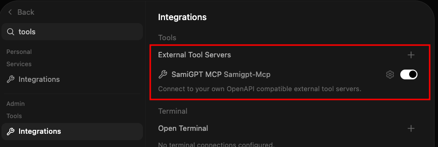
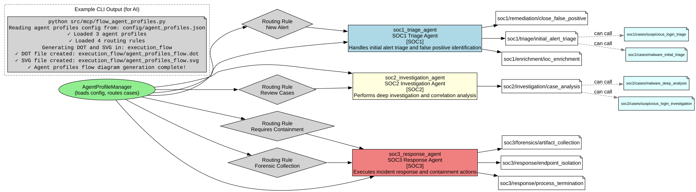
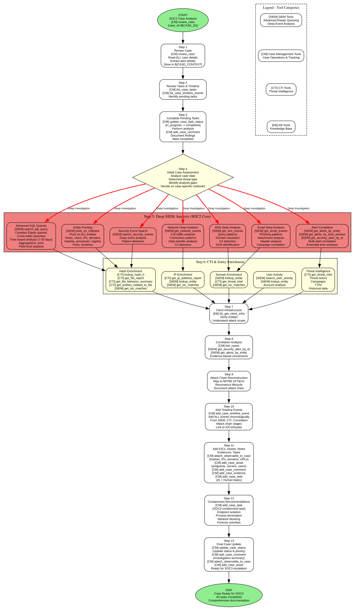

# SamiGPT

**SamiGPT** is an AI-powered security investigation and incident response platform that provides security operations teams with intelligent automation for case management, SIEM analysis, and CTI enrichment through the Model Context Protocol (MCP).

> **Note:** This project is currently under active development. Features, APIs, and documentation may change as development progresses.

## Demo

Watch the demo video to see SamiGPT in action:

[Demo Video](https://youtu.be/usd8ed-7AQg)

For detailed documentation and presentation materials:

[AI Agents Presentation PDF](demo/BHMEA25_AI_Agents.pdf)

### Quick Start

SamiGPT is started from a single entry point. That process serves the web UI
and, by default, also starts the MCP server as a **separate HTTPS listener**
with its own settings and health check.

**Steps:**

1. **Clone the repository and create a virtual environment** (skip if you already have one):
   ```bash
   git clone <repository-url>
   cd SamiGPT
   python3 -m venv venv
   source venv/bin/activate  # On Windows: venv\Scripts\activate
   pip install --upgrade pip
   pip install -r requirements.txt
   ```

2. **Set the UI password** in `config.json` (copied from `config.json.example` automatically on first run):
   ```json
   "web": {
     "username": "admin",
     "password": "choose-a-strong-password",
     "session_secret": "",
     "session_ttl_seconds": 43200
   }
   ```
   `session_secret` is generated automatically if left empty.

3. **Add tokens/URLs for the integrations you want to enable** in `config.json`.
   You only need to fill in the sections for the tools you actually use
   (case management, SIEM, EDR, CTI, LLM provider, etc.) — everything else can
   be left at its placeholder values. For example, to use **Open WebUI** as
   the LLM provider:
   ```json
   "llm": {
     "provider": "openwebui",
     "openwebui": {
       "api_key": "your-openwebui-api-key",
       "base_url": "https://your-openwebui-host:8080",
       "model": "auto"
     }
   }
   ```
   The same pattern applies to other sections, e.g. `thehive.api_key`,
   `iris.api_key`, `elastic.clusters[].api_key`, `edr.api_key`, `cti.base_url`,
   and `netbox.api_token`. See the Configuration section below for the full list.

4. **Start the application:**
   ```bash
   python app.py
   ```
   The UI binds **HTTPS on `0.0.0.0:8081`**. The first start writes a self-signed certificate to `certs/`. Your browser will warn until you trust that cert or replace it with a real one.

   Optional flags:
   ```bash
   python app.py --port 8081
   python app.py --no-mcp    # web UI only; start MCP later from the UI
   python app.py --debug     # auto-reload when files under src/ change
   ```

5. **Open your browser:**
   Navigate to `https://<host>:8081` and sign in. Nothing in the UI, APIs, or static files is reachable without a valid session.

6. **Verify the LLM provider:**
   Open **Settings** to confirm the provider you configured in step 3 (Cursor
   Agent, OpenAI, OpenRouter, Open WebUI, or any OpenAI-compatible endpoint),
   or switch providers here instead. Save, then use **Test provider**.

7. **Check the MCP server:**
   Use the **MCP** button in the header. It shows health, bound host/port,
   registered tools, and start/stop/restart controls. MCP HTTPS routes require
   `Authorization: Bearer <mcp.api_token>` from `config.json`.

8. **Confirm Open WebUI is connected:**
   In SamiGPT, the **MCP** button should show the server as healthy with its
   registered tools listed:

   

   In Open WebUI, add SamiGPT as a tool server under **Settings → Tools**,
   pointing it at the MCP HTTPS listener (`https://<host>:<mcp.port>`, e.g.
   `https://<host>:8082`) with `Authorization: Bearer <mcp.api_token>` from
   `config.json`, then verify the SamiGPT tools appear in the tool list there
   too. Note this is separate from the `llm.openwebui` config in step 3, which
   instead points SamiGPT at Open WebUI as its LLM backend:

   

#### Install as a systemd service (`servee`)

To run SamiGPT as a boot-persistent service, use the installer under `servee/`.
It copies the app to `/opt/servee`, creates a Python 3.10+ venv, installs
dependencies, and enables + starts the `servee` unit (`Restart=always`).
Re-running the script reinstalls cleanly and preserves `config.json`, `certs/`,
`data/`, and `logs/`.

```bash
# Install or reinstall (requires root; stop any manual `python app.py` first)
sudo ./servee/install.sh

# Service control
sudo systemctl status servee
sudo systemctl restart servee
sudo systemctl stop servee
sudo systemctl start servee

# Follow logs
journalctl -u servee -f
```

Optional: point the installer at a specific Python 3.10+ binary:

```bash
sudo PYTHON_BIN=/path/to/python3.11 ./servee/install.sh
```

After install, the UI is at `https://<host>:8081` and MCP at `:8082`, with
runtime files under `/opt/servee`.

## Overview

SamiGPT acts as an MCP server that exposes security investigation and response capabilities as tools that can be used by AI agents, LLM tools, and automated workflows. It provides a unified, vendor-neutral API layer that connects to:

- **Case Management Systems** (TheHive, IRIS)
- **SIEM Platforms** (Elastic)
- **EDR Solutions** (Elastic Defend)
- **Threat Intelligence** (OpenCTI, Local TIP)
- **DCIM/IPAM** (NetBox)

The platform enables automated triage, investigation, correlation, and response workflows through intelligent agent profiles organized by SOC tier (SOC1, SOC2).

## Features

### Core Capabilities

- **Automated Alert Triage**: Intelligent initial assessment and classification of security alerts
- **Case Management**: Create, update, and manage security cases with observables, comments, and timeline tracking
- **SIEM Integration**: Search security events, pivot on indicators, and correlate activities across environments
- **EDR Response**: Endpoint isolation, process termination, and forensic artifact collection
- **Threat Intelligence**: IOC enrichment and reputation analysis
- **Infrastructure Lookup**: Resolve IPs, hosts, and prefixes against NetBox DCIM/IPAM for asset context
- **Multi-Tier SOC Workflows**: Structured workflows for SOC1 (triage) and SOC2 (investigation)

### Agent Profiles & Runbooks

SamiGPT includes pre-configured agent profiles with specialized runbooks:

- **SOC1 Agents**: Initial alert triage, enrichment, and false positive identification
- **SOC2 Agents**: Deep investigation, correlation, and case analysis

## Workflows

SamiGPT uses structured workflows organized by SOC tier. The following diagrams illustrate the execution flow:

### Agent Profiles Flow

This diagram shows how agent profiles are organized and how routing rules direct cases to the appropriate SOC tier agents.



### Initial Alert Triage (SOC1)

The initial alert triage workflow handles new security alerts, performs quick assessment, enrichment, and determines whether to create a case or close as false positive.


### Case Analysis (SOC2)

The SOC2 case analysis workflow performs deep investigation, SIEM analysis, CTI enrichment, correlation, and prepares cases for SOC3 escalation.



## Installation

### Prerequisites

- Python 3.9 or higher (3.10+ if installing as a systemd service via `servee/`)
- pip package manager

### Setup

See "Quick Start" above for cloning the repository, creating the virtual
environment, and installing dependencies. Once `python app.py` is running:

1. **Configure integrations** (see Configuration section below)

### Connect MCP Server to AI Tools

The **official, supported way** to use SamiGPT's tools is to connect them to
**Open WebUI** via the MCP HTTPS listener (see "Confirm Open WebUI is
connected" in Quick Start above). Once SamiGPT is registered as a tool server
in Open WebUI, you can drive it from **any LLM provider Open WebUI
supports** (OpenAI, OpenRouter, local/self-hosted models, etc.) without any
further per-client setup.

Other MCP-compatible clients that speak stdio or HTTPS — such as Cursor or
Claude Desktop — are also supported and can connect directly to
`python -m src.mcp.mcp_server` (stdio) or the HTTPS listener below, but they
are not the primary/tested integration path and are not documented in
detail here.

HTTPS endpoints when `app.py` is running (defaults). Send `Authorization: Bearer <mcp.api_token>`:

- Health: `https://127.0.0.1:8082/health`
- Tools: `https://127.0.0.1:8082/tools`
- JSON-RPC: `POST https://127.0.0.1:8082/rpc`

## Architecture

### Infrastructure Overview


### Directory Structure

```
SamiGPT/
├── src/
│   ├── api/              # Generic interfaces (CaseManagementClient, SIEMClient, EDRClient)
│   ├── core/             # Configuration, logging, errors, DTOs
│   ├── integrations/     # Vendor-specific implementations
│   │   ├── case_management/  # TheHive, IRIS integrations
│   │   ├── siem/             # Elastic integration
│   │   ├── edr/              # EDR platform integrations
│   │   ├── cti/              # Threat intelligence integrations
│   │   ├── netbox/           # NetBox DCIM/IPAM integration
│   │   └── eng/              # Engineering board integrations
│   ├── llm/              # Pluggable LLM providers (Cursor, OpenAI, OpenRouter, Open WebUI, custom)
│   ├── mcp/              # MCP server, HTTP transport, supervisor, runbooks
│   ├── orchestrator/     # Workflow orchestration
│   └── web/              # Legacy integration config UI
├── app.py                # Single entry point for the web interface
├── run_books/            # SOC tier runbooks and workflows
├── config/               # Agent profiles and configuration
└── client_env/           # Client-specific infrastructure data (gitignored except templates)
```

### Design Principles

- **Vendor-Neutral APIs**: All integrations implement generic interfaces, allowing easy swapping of security tools
- **Separation of Concerns**: AI/orchestrator layer only interacts with generic APIs, never vendor-specific code
- **Modular Integration**: Each vendor integration is self-contained with HTTP client, models, mappers, and client implementation

## Configuration

Configuration is managed through `config.json` and can be edited via the web interface or directly.


### Configuration File Structure

See `config.json.example` for the complete configuration schema. Key sections:

- `iris` / `thehive`: Case management configuration
- `elastic`: SIEM configuration
- `edr`: EDR platform configuration
- `cti`: Threat intelligence configuration
- `netbox`: NetBox DCIM/IPAM configuration
- `eng`: Engineering board configuration (ClickUp, Trello, GitHub)
- `ai_controller`: Web interface bind address and session storage
- `llm`: LLM provider used by the web UI (Cursor Agent, OpenAI, OpenRouter, Open WebUI, custom)
- `mcp`: HTTP MCP listener host/port and auto-start
- `logging`: Logging configuration

## Logging

SamiGPT provides comprehensive logging:

- **MCP Server Logs**: `logs/mcp/mcp_all.log`, `mcp_requests.log`, `mcp_responses.log`, `mcp_errors.log`
- **Application Logs**: `logs/debug.log`, `logs/error.log`, `logs/warning.log`

## Development

### Adding a New Integration

1. **Create integration directory** under `src/integrations/`
2. **Implement generic interface** from `src/api/`
3. **Add HTTP client, models, and mappers**
4. **Register in configuration**

Example structure:
```
src/integrations/case_management/new_vendor/
├── __init__.py
├── client.py          # HTTP client
├── models.py          # Vendor-specific models
├── mapper.py          # Vendor ↔ Generic DTO mapping
└── case_client.py     # Implements CaseManagementClient
```

### Running Tests

```bash
# Run all tests
pytest tests/

# Run specific integration tests
pytest tests/integrations/case_management/
```

## Contributing

When contributing:

1. Keep all vendor-specific code under `src/integrations/`
2. Ensure all integrations implement the generic APIs in `src/api/`
3. Add tests for new integrations
4. Update documentation as needed

## License

MIT

## Support

For issues, questions, or contributions, please open an issue on the repository.

## Acknowledgments

The following projects helped and inspired us during the literature review:

- [AI-Powered SOC Detection System](https://github.com/cyberarber/ai-soc-detection-system/tree/main) - ML-powered SOC platform with autonomous threat detection
- [ADK Runbooks](https://github.com/dandye/adk_runbooks/tree/main) - Security investigation runbooks and workflows

## Changelog

### v0.2

- **Single entry point (`app.py`)** serving an authenticated, HTTPS-only web UI (session login, auto-generated self-signed cert)
- **MCP server as a separate HTTPS listener** with its own health check, supervisor, and start/stop/restart controls from the UI
- **Pluggable LLM providers**: Cursor Agent, OpenAI, OpenRouter, Open WebUI, and custom OpenAI-compatible endpoints, selectable and testable from Settings
- **Open WebUI integration path**: SamiGPT registers as an MCP tool server in Open WebUI, so it can be driven from any LLM provider Open WebUI supports
- **Approval queue**: human-in-the-loop review/approval workflow for agent actions before they execute
- **Multi-cluster Elastic support** with per-cluster skill vectors (MSV) controlling which capabilities are enabled per cluster
- **Skill toggles in Settings**: enable/disable individual skills per integration directly from the web UI, instead of editing the skill vector by hand
- **NetBox integration** (DCIM/IPAM) as a new data source for investigations
- **Engineering board integration** (GitHub Issues, Trello) for filing follow-up work from investigations
- **Requests view** in the UI for tracking in-flight and historical tool calls. A request, such as a detection or runbook gap, can be filed directly as a GitHub issue in a repository you configure, for example a Detection-as-Code repository, and its status stays synchronized when that issue is closed
- **systemd service installer** (`servee/`) for running SamiGPT as a boot-persistent service
- Secret-handling and TLS hardening (`core/secrets.py`, `core/tls.py`), plus gitleaks-based secret scanning in CI

### v0.1 — Black Hat version

Presented at Black Hat MEA 2025.

**Performance & Cost**
- ~ $0.18 per alert
- ~ 50 seconds to investigate an alert per agent/tab

For detailed cost and usage data, see: [Cost Data CSV](usage-events/cost_all.csv)
