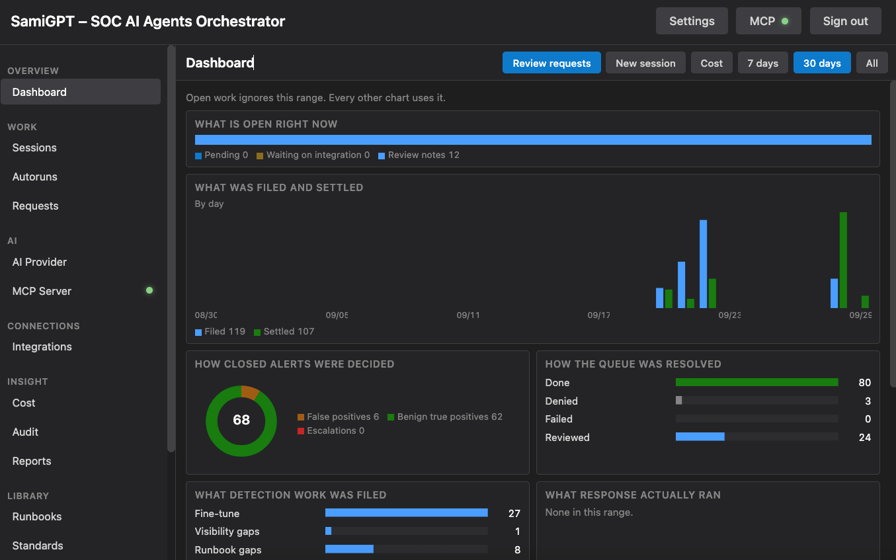
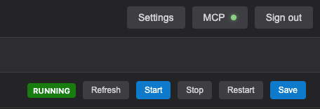
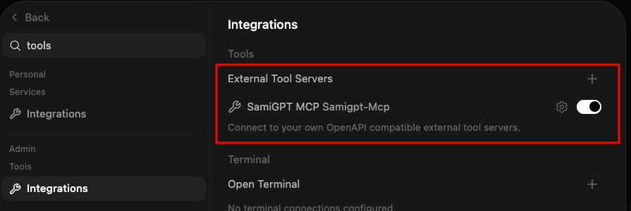
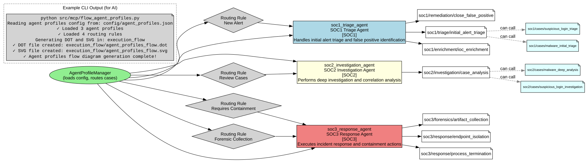
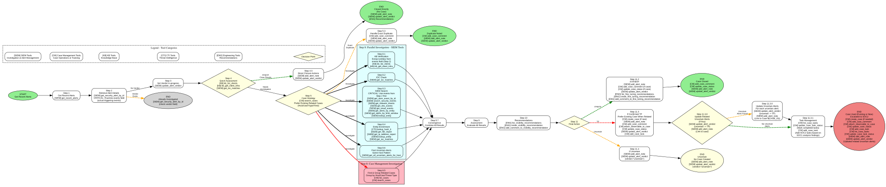
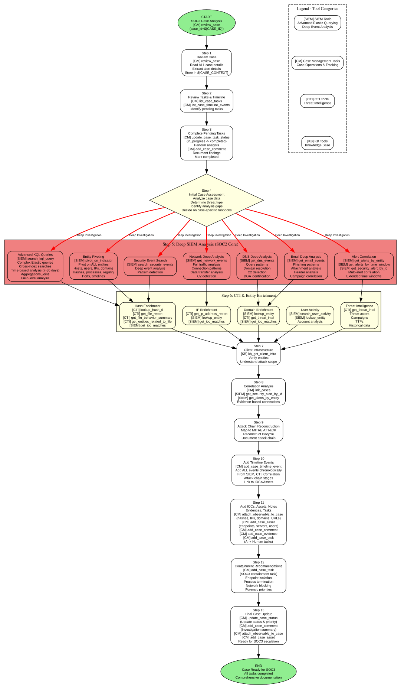
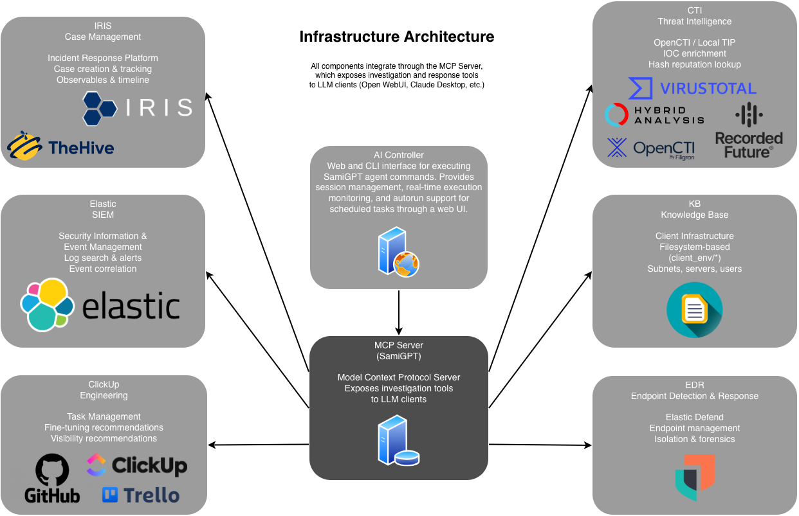

# SamiGPT

**SamiGPT** is an AI-powered security investigation and incident response platform that provides security operations teams with intelligent automation for case management, SIEM analysis, and CTI enrichment through the Model Context Protocol (MCP).

> **Note:** This project is currently under active development. Features, APIs, and documentation may change as development progresses.

## Demo

Watch the demo video to see SamiGPT in action:

[Demo Video](https://youtu.be/usd8ed-7AQg)

For detailed documentation and presentation materials:

[AI Agents Presentation PDF](demo/BHMEA25_AI_Agents.pdf)

SamiGPT's Dashboard:



### Quick Start

Two ways to run SamiGPT. Docker Compose starts a separate copy for setup. The production method is the `servee` systemd service on ports 8081 and 8082.

#### Docker Compose

SamiGPT runs as its own Docker Compose stack from [onboarding/docker-compose.yml](onboarding/docker-compose.yml). That container is new: the UI is on host port **18081** and MCP is on host port **18082**. It does not bind 8081 or 8082, and it does not use the production service.

The container starts with a blank config. A setup wizard at `/setup` asks for the console password and the integration tokens. Skipped steps stay at the placeholders from `config.json.example` and are not treated as connected. Certificate checks for Elastic, the local TIP, and NetBox are left off. The MCP listener binds `0.0.0.0`.

**Start it:**

```bash
docker compose -p samigpt-onboarding -f onboarding/docker-compose.yml up --build
```

**Open the wizard:**

`https://127.0.0.1:18081/setup`

The browser warns about the self-signed certificate written in the container on first start. Accept it for this host. The wizard order is Security, SIEM (Elastic), case management, EDR, threat intel, knowledge and assets, engineering tickets, then AI and MCP. Each optional step has **Skip for now**. **Finish** writes the config and opens the console at `https://127.0.0.1:18081`. Sign in with the username and password from the Security step.

Config and certificates stay in Compose volumes, so the next `up` keeps what the wizard saved. Stop the stack with:

```bash
docker compose -p samigpt-onboarding -f onboarding/docker-compose.yml down
```

Add `-v` only when you want that saved config removed.

**After the wizard**

Use **Refresh models** on the AI step to list models for the token you entered. MCP is reachable on the host at port **18082** (the process inside the container listens on 8082). The AI step stores the public URL and bearer token. Open WebUI can be registered from that same step.

In SamiGPT, the **MCP** button shows health and registered tools:



In Open WebUI, add SamiGPT under **Settings → Tools** using the public MCP URL from the wizard and `Authorization: Bearer <mcp token>`. That is separate from the AI provider URL, which points SamiGPT at Open WebUI:



#### Production service

To run SamiGPT as the boot-persistent production service, use the installer under `servee/`.
It copies the app to `/opt/servee`, creates a Python 3.10+ venv, installs
dependencies, and enables + starts the `servee` unit (`Restart=always`).
Re-running the script reinstalls cleanly and preserves `config.json`, `certs/`,
`data/`, and `logs/`.

`systemctl restart servee` (and every start) syncs this source tree into
`/opt/servee` before launching. `config.json`, `certs/`, `data/`, `logs/`, and
the virtualenv stay in place. Dependencies are reinstalled only when
`requirements.txt` changes. A full wipe, including a new virtualenv, is still
`sudo ./servee/install.sh`.

```bash
# Install or reinstall (requires root; stop any manual `python app.py` first)
sudo ./servee/install.sh

# Service control. Restart syncs code from the tree install.sh was run from.
sudo systemctl status servee
sudo systemctl restart servee
sudo systemctl stop servee
sudo systemctl start servee

# Follow logs
journalctl -u servee -f
```

Optional: point the installer at a specific Python 3.10+ binary:

```bash
sudo PYTHON_BIN=/path/to/python3.11 ./servee/install.sh
```

After install, the UI is at `https://<host>:8081` and MCP at `:8082`, with
runtime files under `/opt/servee`. An existing `config.json` there is kept, so
the console opens at sign-in. A host with no password opens the same setup
wizard at `https://<host>:8081/setup`.

## Overview

SamiGPT acts as an MCP server that exposes security investigation and response capabilities as tools that can be used by AI agents, LLM tools, and automated workflows. It provides a unified, vendor-neutral API layer that connects to:

- **Case Management Systems** (TheHive, IRIS)
- **SIEM Platforms** (Elastic)
- **EDR Solutions** (Elastic Defend)
- **Threat Intelligence** (OpenCTI, Local TIP)
- **DCIM/IPAM** (NetBox)

The platform enables automated triage, investigation, correlation, and response workflows through intelligent agent profiles organized by SOC tier (SOC1, SOC2).

## Features

### Core Capabilities

- **Automated Alert Triage**: Intelligent initial assessment and classification of security alerts
- **Case Management**: Create, update, and manage security cases with observables, comments, and timeline tracking
- **SIEM Integration**: Search security events, pivot on indicators, and correlate activities across environments
- **EDR Response**: Endpoint isolation, process termination, and forensic artifact collection
- **Threat Intelligence**: IOC enrichment and reputation analysis
- **Infrastructure Lookup**: Resolve IPs, hosts, and prefixes against NetBox DCIM/IPAM for asset context
- **Multi-Tier SOC Workflows**: Structured workflows for SOC1 (triage) and SOC2 (investigation)

### Agent Profiles & Runbooks

SamiGPT includes pre-configured agent profiles with specialized runbooks:

- **SOC1 Agents**: Initial alert triage, enrichment, and false positive identification
- **SOC2 Agents**: Deep investigation, correlation, and case analysis

## Workflows

SamiGPT uses structured workflows organized by SOC tier. The following diagrams illustrate the execution flow:

### Agent Profiles Flow

This diagram shows how agent profiles are organized and how routing rules direct cases to the appropriate SOC tier agents.



### Initial Alert Triage (SOC1)

The initial alert triage workflow handles new security alerts, performs quick assessment, enrichment, and determines whether to create a case or close as false positive.



### Case Analysis (SOC2)

The SOC2 case analysis workflow performs deep investigation, SIEM analysis, CTI enrichment, correlation, and prepares cases for SOC3 escalation.



## Installation

### Prerequisites

- Docker Compose, for the setup stack
- Python 3.10 or newer, for the production `servee` service

### Setup

- **Docker Compose:** `docker compose -p samigpt-onboarding -f onboarding/docker-compose.yml up --build`, then `https://127.0.0.1:18081/setup`
- **Production service:** `sudo ./servee/install.sh`, then `https://<host>:8081`

### Connect MCP Server to AI Tools

The **official, supported way** to use SamiGPT's tools is to connect them to
**Open WebUI** from the wizard's AI step, or afterward under **Settings → Tools**
in Open WebUI. Once SamiGPT is registered as a tool server, you can drive it
from **any LLM provider Open WebUI supports** (OpenAI, OpenRouter,
local/self-hosted models, etc.) without any further per-client setup.

Send `Authorization: Bearer` and the MCP token. Use `https` when MCP TLS is on, and `http` when it is left off.

Docker Compose (host port **18082**):

- Health: `http://127.0.0.1:18082/health`
- Tools: `http://127.0.0.1:18082/tools`
- JSON-RPC: `POST http://127.0.0.1:18082/rpc`

Production service (port **8082**):

- Health: `https://<host>:8082/health`
- Tools: `https://<host>:8082/tools`
- JSON-RPC: `POST https://<host>:8082/rpc`

## Architecture

### Infrastructure Overview



### Directory Structure

```
SamiGPT/
├── src/
│   ├── api/              # Generic interfaces (CaseManagementClient, SIEMClient, EDRClient)
│   ├── core/             # Configuration, logging, errors, DTOs
│   ├── integrations/     # Vendor-specific implementations
│   │   ├── case_management/  # TheHive, IRIS integrations
│   │   ├── siem/             # Elastic integration
│   │   ├── edr/              # EDR platform integrations
│   │   ├── cti/              # Threat intelligence integrations
│   │   ├── netbox/           # NetBox DCIM/IPAM integration
│   │   └── eng/              # Engineering board integrations
│   ├── llm/              # Pluggable LLM providers (Cursor, OpenAI, OpenRouter, Open WebUI, custom)
│   ├── mcp/              # MCP server, HTTP transport, supervisor, runbooks
│   ├── orchestrator/     # Workflow orchestration
│   └── web/              # Legacy integration config UI
├── app.py                # Process entry point inside the Compose image
├── onboarding/           # Docker Compose wizard (ports 18081 and 18082)
├── run_books/            # SOC tier runbooks and workflows
├── config/               # Agent profiles and configuration
└── client_env/           # Client-specific infrastructure data (gitignored except templates)
```

### Design Principles

- **Vendor-Neutral APIs**: All integrations implement generic interfaces, allowing easy swapping of security tools
- **Separation of Concerns**: AI/orchestrator layer only interacts with generic APIs, never vendor-specific code
- **Modular Integration**: Each vendor integration is self-contained with HTTP client, models, mappers, and client implementation

## Configuration

Configuration is managed through `config.json` and can be edited via the web interface or directly.


### Configuration File Structure

See `config.json.example` for the complete configuration schema. Key sections:

- `iris` / `thehive`: Case management configuration
- `elastic`: SIEM configuration
- `edr`: EDR platform configuration
- `cti`: Threat intelligence configuration
- `netbox`: NetBox DCIM/IPAM configuration
- `eng`: Engineering board configuration (ClickUp, Trello, GitHub)
- `ai_controller`: Web interface bind address and session storage
- `llm`: LLM provider used by the web UI (Cursor Agent, OpenAI, OpenRouter, Open WebUI, custom)
- `mcp`: HTTP MCP listener host/port and auto-start
- `web`: Console username and password. The wizard hashes the password with Argon2id. A plaintext password is not accepted.
- `logging`: Logging configuration

## Logging

SamiGPT provides comprehensive logging:

- **Session chat transcripts**: one JSON file per session. On the `servee` unit that is `/opt/servee/data/ai_controller/sessions/<session-id>.json`. See [documentation/session-chat-logs.md](documentation/session-chat-logs.md).
- **MCP Server Logs**: `logs/mcp/mcp_all.log`, `mcp_requests.log`, `mcp_responses.log`, `mcp_errors.log`
- **Application Logs**: `logs/debug.log`, `logs/error.log`, `logs/warning.log`

## Development

### Adding a New Integration

1. **Create integration directory** under `src/integrations/`
2. **Implement generic interface** from `src/api/`
3. **Add HTTP client, models, and mappers**
4. **Register in configuration**

Example structure:
```
src/integrations/case_management/new_vendor/
├── __init__.py
├── client.py          # HTTP client
├── models.py          # Vendor-specific models
├── mapper.py          # Vendor ↔ Generic DTO mapping
└── case_client.py     # Implements CaseManagementClient
```

### Running Tests

```bash
# Run all tests
pytest tests/

# Run specific integration tests
pytest tests/integrations/case_management/
```

## Contributing

When contributing:

1. Keep all vendor-specific code under `src/integrations/`
2. Ensure all integrations implement the generic APIs in `src/api/`
3. Add tests for new integrations
4. Update documentation as needed

## License

MIT

## Support

For issues, questions, or contributions, please open an issue on the repository.

## Acknowledgments

The following projects helped and inspired us during the literature review:

- [AI-Powered SOC Detection System](https://github.com/cyberarber/ai-soc-detection-system/tree/main) - ML-powered SOC platform with autonomous threat detection
- [ADK Runbooks](https://github.com/dandye/adk_runbooks/tree/main) - Security investigation runbooks and workflows

## Changelog

### v0.3

- **Setup wizard**: a new install can be configured in the browser, so the console password, integrations, and MCP are ready without hand-editing `config.json`
- **Docker Compose**: setup in its own container, without touching the production service
- **Operators page**: change the console username and password from the UI (the new password is stored as a new Argon2id hash) and see the actions that account may approve, grouped by SOC, detection engineering, and engineering
- **Audit view**: append-only record of sign-in, failed sign-in, and sign-out, merged with approval decisions (approved, denied, reviewed, ignored). Passwords and session tokens are never written
- **Reports view**: finished investigation write-ups from completed session replies, listed newest first and opened as markdown
- **Library in the console**: runbooks (shared plus SOC1/SOC2/SOC3), standards, and operator documentation, read from the repo and rendered in the UI
- **Overview dashboard**: landing page with 7-day, 30-day, and all-time charts for open work, what was filed and settled, how closed alerts were decided, how the approval queue was resolved, detection work filed, response actions that ran, and model spend
- **Session tab bar**: pin sessions, drag to reorder, an overflow menu of every open session, and a new-session shortcut (`Alt+N`)
- **Appearance**: three palettes (`U-Theme`, `FT-Theme`, `B-Theme`) plus a system mode that follows the browser light/dark preference, stored in this browser

### v0.2

- **Single entry point (`app.py`)** serving an authenticated, HTTPS-only web UI (session login, auto-generated self-signed cert)
- **MCP server as a separate HTTPS listener** with its own health check, supervisor, and start/stop/restart controls from the UI
- **Pluggable LLM providers**: Cursor Agent, OpenAI, OpenRouter, Open WebUI, and custom OpenAI-compatible endpoints, selectable and testable from Settings
- **Open WebUI integration path**: SamiGPT registers as an MCP tool server in Open WebUI, so it can be driven from any LLM provider Open WebUI supports
- **Approval queue**: human-in-the-loop review/approval workflow for agent actions before they execute
- **Multi-cluster Elastic support** with per-cluster skill vectors (MSV) controlling which capabilities are enabled per cluster
- **Skill toggles in Settings**: enable/disable individual skills per integration directly from the web UI, instead of editing the skill vector by hand
- **NetBox integration** (DCIM/IPAM) as a new data source for investigations
- **Engineering board integration** (GitHub Issues, Trello) for filing follow-up work from investigations
- **Requests view** in the UI for tracking in-flight and historical tool calls. A request, such as a detection or runbook gap, can be filed directly as a GitHub issue in a repository you configure, for example a Detection-as-Code repository, and its status stays synchronized when that issue is closed
- **systemd service installer** (`servee/`) for running SamiGPT as a boot-persistent service
- Secret-handling and TLS hardening (`core/secrets.py`, `core/tls.py`), plus gitleaks-based secret scanning in CI

### v0.1 — Black Hat version

Presented at Black Hat MEA 2025.

**Performance & Cost**
- ~ $0.18 per alert
- ~ 50 seconds to investigate an alert per agent/tab

For detailed cost and usage data, see: [Cost Data CSV](usage-events/cost_all.csv)
